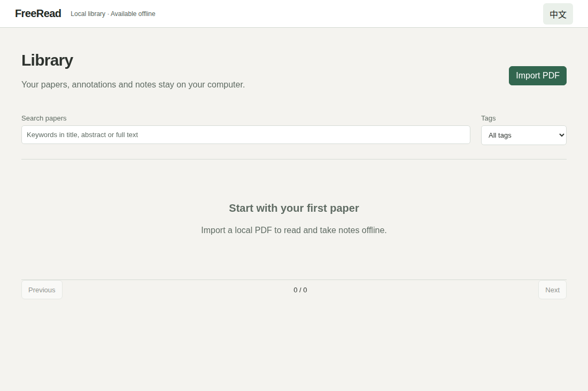
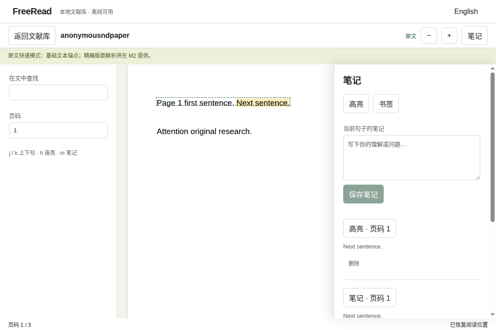

# 交付报告 T-008 / T-009 / T-003

- 状态：部分完成。M1 实现、本地质量门禁、三平台原生开发版与打包版 E2E、打包与冷启动已通过；本机打包版功能、强杀 20 次、renderer 崩溃恢复及千页性能已通过。启动阻塞已解除，首次冷启动超预算的稳定性风险及自托管性能 runner 仍待解决。
- 规范遵循：00 §2/4/7/8、01 §1/4、02 §3.2、05 §1/4/7/11、06 §2/5、07 §1/3/5、10 E2/E4/E6/E11/E14/E15、13 §5。规范提交 `252e2e9`；ADR-14 解决进度真源冲突，meta schemaVersion 2，并提供 v1 迁移。锚点 schema 保持 1。
- 输出：授权文件选择、worker PDF 提取、sha256 去重、原子目录发布、标签、同一中文分词函数支持 FTS5 标题/摘要/正文；SQLite WAL 可重建及损坏保留；原文可视页 canvas、PDF.js textLayer、选择高亮/笔记/书签、追加标注与墓碑、Markdown；句子即时同步原子保存与 OpLogEntry 启动补偿、页码回退与可见降级。
- 验证证据：`pnpm verify` 通过（19 个单元/集成用例 + 3 个 Node 门禁用例，core 44/44 分支、62/62 语句）；默认跳过需 Edge 的补充预览，用 `FR_UI_PREVIEW=1` 单独实跑成功。17 份生成物一致；597 个依赖许可条目通过；10 篇授权 PDF 哈希通过。补充集成断言：文献目录被外部 junction 替换后，标注/Markdown 写入均拒绝；验证器首次使用及缓存后仍拒绝嵌套非法类型、额外属性和越界值。
- `pnpm build`、`pnpm size` 通过；renderer + PDF worker gzip 合计约 611 KiB。PDF.js 是规范指定的阅读引擎（Apache-2.0，安装前 `pnpm license check pdfjs-dist` 通过）；其体积超过普通前端组件阈值，因为包含实际 PDF 解释器与隔离 worker。未引入 SQLite 原生模块、路由库或虚拟列表库；库用 50 条分页、阅读器只渲染可视页。
- 真实 PDF 提取：授权样本 `jmlr-22-0801` 27 页 / 10875 个最小文本句段，worker 成功；不宣称这些基础块满足 M2 的版面指标。
- 补充浏览器证据：Edge 154.0.4258.48、真实 PDF worker 和真实 SQLite/文件服务，生成 1000 页文本 PDF；首屏 1038 ms、10 秒滚动约 120.06 fps、canvas ≤ 5。截图位于 `test-results/m1-{library,reader}-browser.png`，测量 JSON `test-results/m1-browser-performance.json`。此预览只为本地 QA 放行同源 HTTP，发布应用仍仅 `fr-file:`；不能等同 Electron、复杂真实 PDF 或固定硬件正式性能门禁。
- 新增测试：确定性/字符覆盖/非法输入、句子缺失与页码越界、v1 迁移、CJK 分词对称、去重与源 PDF 字节不变、删除 SQLite 后精确恢复、文件不可写时日志补偿、标注损坏/断尾后继续追加、墓碑、Markdown、SQLite 损坏重建、路径及会话越界。原生 E2E 新增 5 次精确恢复、笔记重启、20 次强杀与 1000 页性能断言，阈值未降低。
- 本机固定验收：已确认仓库低完整性标签使 exe 以低完整性运行，窗口站创建被拒。保留仓库标签，在普通系统临时目录运行字节一致的打包版。当前按需加载版原生 4/4 E2E、五次真正关闭重启、20/20 强杀及千页性能通过（首屏 922.19 ms / 120.15 fps）；首次启动 2674 ms，直接在普通目录构建后首次启动 2733 ms，仍超过 2500 ms。候选版 2851 ms 失败及 988–1146 ms 复测通过均保留为历史证据。启动 trace 显示 GPU 初始化约 956 ms，不能用诊断参数或重叠事件替代正式测量。机器参数、JSON/日志及脚本见 [本机验收记录](m1-local-acceptance.md)。
- 原生 CI：[run 37101443857](https://github.com/cristimezzz/FreeRead/actions/runs/37101443857)（运行时代码 `f04f2bd`）三平台全绿，均完成 verify/build/size、4/4 开发版及 4/4 打包版 E2E、打包与冷启动。两组 E2E 均断言 5/5 句子恢复、高亮与笔记重启保留、renderer 崩溃自动重载及 20/20 进程树强杀恢复；打包测试断言 `app.isPackaged`。修复包含 sandbox preload 依赖内联、PDF.js legacy 兼容构建、Windows 强杀残留子进程清理，以及高亮等待 textLayer 几何就绪。草稿 [PR #2](https://github.com/cristimezzz/FreeRead/pull/2) 以尚未合并的 M0 分支为基线；未合并或发布。
- 原生 hosted runner 打包版测量（同轮，Electron 39.8.10）：Windows x64 首屏 513 ms / 64.14 fps / 冷启动 995 ms；macOS arm64 475 ms / 60.11 fps / 1205 ms；Linux x64 268 ms / 60.11 fps / 599 ms。首屏与帧率使用合成 1000 页 PDF，canvas ≤ 5；冷启动独立运行且不连接调试器。性能数据不跨机器比较，不能代替固定机器正式验收。原始 `performance.json`（含 OS、CPU、内存、运行时版本）与截图可从该 CI 的 test-evidence 工件下载；Windows ARM64 与 macOS x64 安装包已构建，未在对应架构机器执行。
- 提交 `7c0d62d` 的 [CI run 37119627119](https://github.com/cristimezzz/FreeRead/actions/runs/37119627119) 三平台完整门禁再次通过。启动优化候选 `4f98cbb` 的 [CI run 37122082721](https://github.com/cristimezzz/FreeRead/actions/runs/37122082721) 三平台开发版重启失败；已在本机复现，并恢复持久化文件验证器原来的提前编译，保留 IPC 按需编译与 E4 五次真正重启的断言。清理代码保存进程句柄，避免关闭后的 `app.process()` 异常掩盖原始错误。修复 `bb65f9a` 的 [三平台 CI](https://github.com/cristimezzz/FreeRead/actions/runs/37123369010) 全部通过。
- 当前优化：空库只加载 237.65 kB 入口，507.32 kB 阅读模块在打开文献时加载；前端 gzip 合计约 611 KiB。固定本地模块的动态导入已逐项审查，只有 renderer / PDF.js 依赖，所有特权操作仍经 `window.fr`；仅该行登记 lint 审查例外，原全局禁止规则保留。新错误边界将加载异常转换为既有 `FR-UI-001`，可返回文献库；原生 E1 断言空库没有加载该模块，并拦截模块请求验证错误兜底。完整打包版 4/4、本地 `pnpm verify` 通过。
- 固定机器 CI：用户已授权本机一次性 runner。新增可选 job 只接受当前仓库 PR #2、M1 分支及 `run-m1-local-once` 标记，使用专属 runner 标签，按 PR head SHA 检出。先执行首次冷启动，再执行全部 E2E；冷启动失败仍采集功能证据，最后明确阻断整体门禁，不降低阈值。验收后注销 runner 并移除标记；本次运行结果待记录。
- 未决：首次冷启动超预算的稳定性风险及规范要求的自托管性能 runner。M2 版面解析、OCR、重排及 M3–M7 功能不在此次范围。

以下截图来自上述 Linux 打包版 E2E 的合成 PDF，展示真实导入和重启后保留的高亮、笔记：

## 变更文件

下表按目录归并；逐文件行数见末尾清单。

| 范围 | 内容 |
|---|---|
| `packages/core/src/{anchor,progress,search,storage}` | 最小阅读模型、纯位置恢复、迁移、citekey、中文分词、由规范生成的 DDL、测试 |
| `apps/desktop/src/main/{infra,services,ipc}` | 文件原子操作、本地 PDF Range 协议、SQLite、库/笔记/阅读服务、worker、严格 IPC、集成测试 |
| `apps/desktop/src/renderer` | 原文阅读器、文献库、笔记面板、双语文案、响应式布局 |
| `apps/desktop/e2e` | 原始合成 PDF、原生功能/崩溃/性能用例 |
| `specs/`、`docs/adr/ADR-14-m1-reading.md` | M1 卡片、进度真源修订及 schema v2 |
| 依赖/生成器/许可产物 | PDF.js、冻结锁文件、生成 DDL/preload、本地许可清单 |

| 文件 | 全文行数 / 二进制字节数 |
|---|---:|
| `.github/workflows/ci.yml` | 134 |
| `AGENTS.md` | 130 |
| `README.md` | 37 |
| `THIRD_PARTY_NOTICES.md` | 7798 |
| `apps/desktop/e2e/electron-app.ts` | 16 |
| `apps/desktop/e2e/pdf-fixture.ts` | 20 |
| `apps/desktop/e2e/reader.e2e.ts` | 115 |
| `apps/desktop/e2e/shell.e2e.ts` | 47 |
| `apps/desktop/electron.vite.config.ts` | 8 |
| `apps/desktop/package.json` | 25 |
| `apps/desktop/src/main/index.ts` | 78 |
| `apps/desktop/src/main/infra/config.ts` | 20 |
| `apps/desktop/src/main/infra/files.ts` | 72 |
| `apps/desktop/src/main/infra/index-store.ts` | 91 |
| `apps/desktop/src/main/infra/pdf-protocol.ts` | 41 |
| `apps/desktop/src/main/ipc/contract-data.generated.ts` | 2 |
| `apps/desktop/src/main/ipc/handlers.ts` | 115 |
| `apps/desktop/src/main/ipc/validate.test.ts` | 11 |
| `apps/desktop/src/main/ipc/validate.ts` | 33 |
| `apps/desktop/src/main/services/extract.ts` | 26 |
| `apps/desktop/src/main/services/library-service.test.ts` | 132 |
| `apps/desktop/src/main/services/library-service.ts` | 168 |
| `apps/desktop/src/main/services/note-service.ts` | 121 |
| `apps/desktop/src/main/services/pdf-worker.ts` | 32 |
| `apps/desktop/src/main/services/preview.test.ts` | 96 |
| `apps/desktop/src/main/services/reader-service.ts` | 38 |
| `apps/desktop/src/preload/bridge.generated.ts` | 112 |
| `apps/desktop/src/renderer/env.d.ts` | 1 |
| `apps/desktop/src/renderer/i18n/en.json` | 83 |
| `apps/desktop/src/renderer/i18n/text.ts` | 7 |
| `apps/desktop/src/renderer/i18n/zh-CN.json` | 83 |
| `apps/desktop/src/renderer/index.html` | 10 |
| `apps/desktop/src/renderer/ipc/api.ts` | 23 |
| `apps/desktop/src/renderer/ipc/client.generated.ts` | 115 |
| `apps/desktop/src/renderer/main.tsx` | 32 |
| `apps/desktop/src/renderer/shell.css` | 23 |
| `apps/desktop/src/renderer/views/LibraryView.tsx` | 65 |
| `apps/desktop/src/renderer/views/NotesPanel.tsx` | 30 |
| `apps/desktop/src/renderer/views/OriginalPane.tsx` | 66 |
| `apps/desktop/src/renderer/views/PdfPage.tsx` | 69 |
| `apps/desktop/src/renderer/views/ReaderBoundary.tsx` | 18 |
| `apps/desktop/src/renderer/views/ReaderView.tsx` | 84 |
| `apps/desktop/src/renderer/views/use-reader.ts` | 91 |
| `docs/adr/ADR-14-m1-reading.md` | 17 |
| `docs/assets/m1-candidate-performance.json` | 1 |
| `docs/assets/m1-library.png` | 36360 bytes |
| `docs/assets/m1-local-cold-start.txt` | 92 |
| `docs/assets/m1-local-performance.json` | 1 |
| `docs/assets/m1-local-startup-profile.json` | 14 |
| `docs/assets/m1-reader.png` | 64925 bytes |
| `docs/m1-delivery.md` | 112 |
| `docs/m1-local-acceptance.md` | 73 |
| `docs/run-m1-native-acceptance.ps1` | 30 |
| `package.json` | 55 |
| `packages/core/src/anchor/m1-model.ts` | 46 |
| `packages/core/src/index.ts` | 16 |
| `packages/core/src/ipc-payloads.generated.ts` | 4580 |
| `packages/core/src/meta.generated.ts` | 145 |
| `packages/core/src/progress/resolve.test.ts` | 43 |
| `packages/core/src/progress/resolve.ts` | 21 |
| `packages/core/src/search/segment.ts` | 4 |
| `packages/core/src/storage/citekey.ts` | 13 |
| `packages/core/src/storage/schema.generated.ts` | 2 |
| `packages/core/src/storage/schema.sql` | 117 |
| `pnpm-lock.yaml` | 6391 |
| `scripts/gen.mjs` | 117 |
| `specs/02-domain-model.md` | 196 |
| `specs/05-storage.md` | 557 |
| `specs/06-ipc-contract.md` | 825 |
| `specs/07-ui-spec.md` | 1024 |
| `specs/13-task-template.md` | 191 |
| `specs/README.md` | 187 |
| `specs/schemas/meta.schema.json` | 190 |
